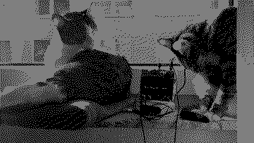
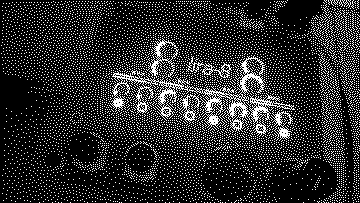

## LNRA-8. Organismic synthesizer for norns

A norns interface to Mike Moreno's [LIRA-8](https://github.com/MikeMorenoDSP/LIRA-8), A Pd emulation of SOMA's [LYRA-8](https://somasynths.com/lyra-organismic-synthesizer/).

What is an "organismic synthesizer"? SOMA says of their LYRA-8

> “Organismic” means that LYRA uses some principles that lie in the base of living organisms. The way how LYRA’s modules interacting between each other and the behaviour of the instrument resembles a live conversation.

It is a kind of a hierarchical organization of eight oscillators in four pairs on two sides, with cross-modulation. LFO, delay and distortion to taste.

LIRA-8 is a Pd emulation/version/variation of that. It is in itself great fun to explore on the computer, running [Pure Data](https://llllllll.co/t/puredata-thread/7291) or it's modern variant [plug data](https://plugdata.org/). LNRA-8 continues my interest/[intéressement](https://en.wikipedia.org/wiki/Interessement) exploring Pd on our beloved norns as a sound engine alternative to SuperCollider, earlier started with [Swarmatron](https://llllllll.co/t/swarmatron/60315) and a growing bunch of private explorations. Running LIRA-8 on norns rather than a computer is probably *worse* than on real computer (limited UI; audio glitching), but also somehow *better* (fun; "why not?"; MIDI mapping). You can ruminate on "worse" and "better" under the concept of *organismic*, while zoning/droning yourself out with LNRA-8.

Thanks to Mike Moreno for making LIRA-8, and for granting me permission to publish this modest norns interface to it. We have a thread on [SOMA Labs Lyra 8](https://llllllll.co/t/soma-labs-lyra-8/22513).

### Requirements

- norns
- [Pure Data](https://puredata.info/) installed on norns

LIRA-8, thereby *lnra-8* has a lot of controls, so you will probably want MIDI and/or OSC controllers and [map](https://monome.org/docs/norns/control-clock/#map) them via the params menu.

### Documentation

The main part is represented on the norns screen. You can change the hold (=droning) of left and right sides with <kbd>E2</kbd> and <kbd>E3</kbd>, and their pitches with <kbd>K1</kbd>+<kbd>E2</kbd> and <kbd>K1</kbd>+<kbd>E3</kbd> respectively. If you choose a MIDI controller and a channel in the parameters, you can use eight white keys from middle-C upwards to hold the eight sensors. 

LNRA-8 interface mimics those of LIRA-8 and LYRA-8. Those are both good to keep in front of you when you familiarize yourself with *LNRA-8*.

| LIRA-8 | LYRA-8 |
|--- | ---|
|  |  |

Oscillator tuning are randomized on startup, and effects turned down. Adjust modulation amount and paths, brighness and other stuff in the parameters, or better yet map them to MIDI or OSC controllers.

It seems to work with at least some of the [fx mod](https://llllllll.co/t/fx-mod/62726) effects for extra juice.

### Download

1. install Pure Data (Pd) on your norns
   - either `sudo apt install puredata` over [ssh](https://monome.org/docs/norns/advanced-access/#ssh)
   - or `os.execute("sudo apt install puredata")` in Maiden REPL
2. Install this script with `;install https://github.com/xmacex/lnra-8`
3. Cross fingers and hope it will work.

That should be it. Later I hope to use Mike Moreno's LIRA-8 as a git submodule rather than including it directly.
