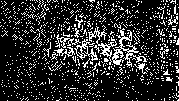

# LIRA-8 for norns

This is a little norns interface to Mike Moreno's [LIRA-8](https://github.com/MikeMorenoDSP/LIRA-8), which itself is a Pd emulation of SOMA Lab's famous organismic synthesizer [LYRA-8](https://somasynths.com/lyra-organismic-synthesizer/).

This runs Mike Moreno's Pd patch as the sound engine, so Pd needs to be installed.

## Usage

Encoders <kbd>e2</kbd> and <kbd>e3</kbd> control the hold volume of the two sides (1-4 and 5-8), and with <kbd>E1</kbd> their pitch

The first eight keys from middle-C upward are mapped to the eight sensor plates on a MIDI keyboard and channel selected in the params.

Beyond that, use MIDI mapping to use your MIDI controllers. The LYRA-8 is a complex organism and interfacing with it on the small norns is hard. All the things in the LIRA-8 emulator are set up as norns parameters. The norns on-screen UI shows the oscillator, but not all modulation options, the hyperlfo or the mixer block.

## Installation

1. Install with `;install https://github.com/xmacex/lira-8` in maiden
2. Install pure data with `apt install puredata`
3. Then install Mike Moreno's LIRA-8 TODO howwwww did I change it somehow?
